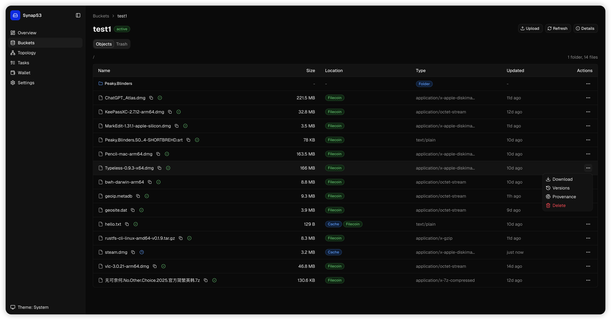

# SynapS3

[](https://github.com/strahe/SynapS3/actions/workflows/ci.yml)
[](https://github.com/strahe/SynapS3/pkgs/container/synaps3)
[](https://goreportcard.com/report/github.com/strahe/synaps3)
[](go.mod)

SynapS3 is an S3-compatible gateway for storing objects on Filecoin.

## Highlights

- S3-compatible bucket and object APIs.
- Object storage backed by Filecoin storage providers.
- Web dashboard for buckets, objects, wallet, tasks, topology, settings, and health.
- Multipart uploads for large objects.
- Wallet funding, USDFC deposit, and background task controls.

## Quick Start

Choose the path that matches how you want to run SynapS3. Each option includes the core commands; full deployment details live in the linked guides.

<details>
<summary>Quick evaluation with docker run</summary>

Prerequisites:

- [Docker Engine](https://docs.docker.com/engine/install/) or [Docker Desktop](https://docs.docker.com/get-started/get-docker/)
- [Host networking](https://docs.docker.com/engine/network/tutorials/host/) enabled for Docker Desktop

The commands use Docker host networking so the admin server can stay bound to `127.0.0.1`.

```bash
cp .env.example .env
docker run --rm ghcr.io/strahe/synaps3:edge synaps3 wallet generate
```

Copy the generated private key into `.env`, then fund the generated address on Calibration:

```bash
docker run --rm --env-file .env ghcr.io/strahe/synaps3:edge synaps3 wallet fund-testnet 0x...
```

If it fails, claim manually from [ChainSafe](https://forest-explorer.chainsafe.dev/faucet) or [Plumbline](https://faucet.reiers.io/).

Start a temporary service:

```bash
docker volume create synaps3-test-data
docker run -d --name synaps3-test \
  --network host \
  --env-file .env \
  -v synaps3-test-data:/var/lib/synaps3 \
  ghcr.io/strahe/synaps3:edge
```

Check health and deposit USDFC:

```bash
curl http://127.0.0.1:9090/healthz
docker exec synaps3-test synaps3 --config /var/lib/synaps3/config.toml wallet deposit 2
```

Open the dashboard at `http://127.0.0.1:9090` and upload a file. If the host is remote, use an SSH tunnel:

```bash
ssh -L 9090:127.0.0.1:9090 user@server
```

Clean up the testing container when done:

```bash
docker rm -f synaps3-test
docker volume rm synaps3-test-data
```

</details>

<details>
<summary>Long-running deployment with Docker Compose</summary>

Use this flow for a single Linux host. See the [Docker deployment guide](docs/deployment/docker.md) for full deployment, upgrade, backup, and operations notes.

Prerequisites:

- [Docker Engine](https://docs.docker.com/engine/install/) with [Docker Compose v2.24 or later](https://docs.docker.com/compose/install/)
- A durable local disk for the Docker volume

Prepare local environment overrides:

```bash
cp .env.example .env
```

Generate a wallet:

```bash
docker compose run --rm synaps3 synaps3 wallet generate
```

Copy the generated private key into `.env`, then fund the generated address on Calibration:

```bash
docker compose run --rm synaps3 synaps3 wallet fund-testnet 0x...
```

Start SynapS3:

```bash
docker compose up -d
docker compose logs --tail=50 synaps3
```

Check health and deposit USDFC:

```bash
curl http://127.0.0.1:9090/healthz
docker compose exec synaps3 synaps3 --config /var/lib/synaps3/config.toml admin status
docker compose exec synaps3 synaps3 --config /var/lib/synaps3/config.toml wallet deposit 2
```

Open the dashboard at `http://127.0.0.1:9090`. If the host is remote, use an SSH tunnel:

```bash
ssh -L 9090:127.0.0.1:9090 user@server
```

</details>

<details>
<summary>Build from source</summary>

Use this flow for local development or custom binaries. See the [source build guide](docs/deployment/source.md) for the full build and first-upload flow.

Prerequisites:

- [Go](https://go.dev/doc/install) 1.26.3 or later
- [make](https://www.gnu.org/software/make/)
- C toolchain for cgo, such as [gcc](https://gcc.gnu.org/install/) or [clang](https://clang.llvm.org/get_started.html)
- [Node.js](https://nodejs.org/en/download) 22.12 or later
- [pnpm](https://pnpm.io/installation) 11

Clone and build SynapS3 with the embedded dashboard:

```bash
git clone https://github.com/strahe/SynapS3.git
cd SynapS3
make build
```

Initialize local app data and generate a wallet:

```bash
./bin/synaps3 init
./bin/synaps3 wallet generate
```

Set `filecoin.private_key` in `~/.synaps3/config.toml`, then fund the generated address on Calibration:

```bash
./bin/synaps3 wallet fund-testnet 0x...
```

Start SynapS3:

```bash
./bin/synaps3 serve
```

In another terminal, deposit USDFC before uploading:

```bash
./bin/synaps3 wallet deposit 2
```

Open the dashboard at `http://127.0.0.1:9090`.

</details>

## Documentation

- [Docker deployment](docs/deployment/docker.md)
- [Build from source](docs/deployment/source.md)
- [Configuration](docs/configuration.md)
- [Operations](docs/operations.md)

## Core S3 Compatibility

| Area | Operation | Status | Notes |
| --- | --- | --- | --- |
| Bucket | `CreateBucket` | ✅ | Creates a bucket |
| Bucket | `HeadBucket` | ✅ | Checks bucket metadata |
| Bucket | `ListBuckets` | ✅ | Lists active buckets |
| Bucket | `DeleteBucket` | ❌ | Bucket deletion is not part of the current lifecycle |
| Bucket | `GetBucketVersioning` | ✅ | Buckets are always versioning-enabled |
| Bucket | `PutBucketVersioning` | ⚠️ | Accepts `Enabled`; `Suspended` is rejected |
| Object | `PutObject` | ✅ | Stores an object |
| Object | `GetObject` | ✅ | Reads an object |
| Object | `HeadObject` | ✅ | Reads object metadata |
| Object | `DeleteObject` | ✅ | Soft-deletes one object |
| Object | `DeleteObjects` | ✅ | Soft-deletes multiple objects |
| Object | `CopyObject` | ✅ | Source object must be readable from cache or committed provider storage |
| Object | `ListObjects` | ✅ | Marker pagination |
| Object | `ListObjectsV2` | ✅ | Continuation-token pagination |
| Object | `ListObjectVersions` | ✅ | Lists object versions and delete markers |
| Object | `GetObjectAttributes` | ✅ | Reports ETag, checksum, size, and storage class |
| Multipart | `CreateMultipartUpload` | ✅ | Starts an upload |
| Multipart | `UploadPart` | ✅ | Uploads one part |
| Multipart | `UploadPartCopy` | ⚠️ | Whole-object copy only; range copy is not supported |
| Multipart | `CompleteMultipartUpload` | ✅ | Assembles parts |
| Multipart | `AbortMultipartUpload` | ✅ | Cancels an upload |
| Multipart | `ListMultipartUploads` | ✅ | Lists open uploads |
| Multipart | `ListParts` | ✅ | Lists uploaded parts |

## License

See [LICENSE](LICENSE).
