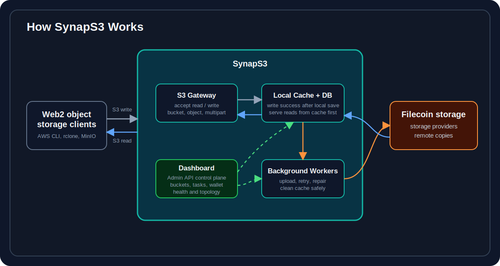

# SynapS3

SynapS3 is an open-source, self-hosted S3-compatible gateway for Filecoin storage.

## Documentation

- [Documentation](https://synaps3.strahe.com/en/)
- [中文文档](https://synaps3.strahe.com/zh/)

## Highlights

- S3-compatible bucket, object, versioning, and multipart APIs.
- Cache-first reads and writes, with Filecoin upload handled in the background.
- Admin dashboard for objects, wallet, tasks, topology, settings, and health.
- Docker Compose or source build for single-node deployments.

Coming soon: replica repair for provider outages.

## Dashboard

## Architecture

Writes commit to local cache and metadata before returning success. Reads use local cache first, then committed Filecoin copies when available.

## Core S3 Compatibility

| Area | Operation | Status | Notes |
| --- | --- | --- | --- |
| Bucket | `CreateBucket` | ✅ | Creates a bucket |
| Bucket | `HeadBucket` | ✅ | Checks bucket metadata |
| Bucket | `ListBuckets` | ✅ | Lists active buckets |
| Bucket | `DeleteBucket` | ❌ | Bucket deletion is not supported |
| Bucket | `GetBucketVersioning` | ✅ | Buckets are always versioning-enabled |
| Bucket | `PutBucketVersioning` | ⚠️ | Accepts `Enabled`; `Suspended` is rejected |
| Object | `PutObject` | ✅ | Stores an object |
| Object | `GetObject` | ✅ | Reads an object |
| Object | `HeadObject` | ✅ | Reads object metadata |
| Object | `DeleteObject` | ✅ | Creates a delete marker, or deletes a specific `versionId` |
| Object | `DeleteObjects` | ✅ | Creates delete markers, or deletes specific `versionId` entries |
| Object | `CopyObject` | ✅ | Source object must be readable from cache or committed Filecoin storage |
| Object | `ListObjects` | ✅ | Marker pagination |
| Object | `ListObjectsV2` | ✅ | Continuation-token pagination |
| Object | `ListObjectVersions` | ✅ | Lists object versions and delete markers |
| Object | `GetObjectAttributes` | ✅ | Reports metadata and multipart `ObjectParts`; `TotalPartsCount` is not emitted |
| Multipart | `CreateMultipartUpload` | ✅ | Starts an upload |
| Multipart | `UploadPart` | ✅ | Uploads one part |
| Multipart | `UploadPartCopy` | ⚠️ | Whole-object copy only; range copy is not supported |
| Multipart | `CompleteMultipartUpload` | ✅ | Assembles parts |
| Multipart | `AbortMultipartUpload` | ✅ | Cancels an upload |
| Multipart | `ListMultipartUploads` | ✅ | Lists open uploads |
| Multipart | `ListParts` | ✅ | Lists uploaded parts |

## License

See [LICENSE](LICENSE).
