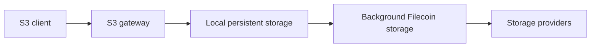

# Architecture

SynapS3 is a single-node gateway between S3 clients and Filecoin storage. It accepts S3 requests, keeps accepted writes locally durable, and continues Filecoin storage in the background.

## System Shape

The key boundary is between the S3 response and Filecoin upload. When a write is confirmed, local durability is complete. Filecoin upload continues after the response.

## User-Visible Components

| Component | Responsibility |
| --- | --- |
| S3 clients | Use familiar S3 operations and credentials. |
| S3 gateway | Validates requests and returns S3-compatible responses. |
| Local persistent storage | Keeps accepted object data and metadata available while background storage progresses. |
| Background Filecoin storage | Completes the initial target copies, retries failed tasks, and evicts cache when policy allows. |
| Dashboard and Admin API | Show health, storage progress, configuration, and actions that need operator attention. |

## Design Principles

- Confirmed S3 writes must survive async upload failures.
- Object visibility and object storage progress are tracked separately.
- Cache eviction only happens after the configured remote-copy policy is satisfied.
- SynapS3 uses a single-node design and does not assume distributed coordination.

## What This Means for Operators

| Behavior | Operator impact |
| --- | --- |
| S3 writes land locally first | While local runtime data is intact, accepted writes remain available from local storage until eligible cache eviction. After eviction, reads require an available remote copy. |
| Background tasks handle Filecoin upload | Watch task queues and exhausted tasks. |
| Cache is part of durability | Treat cache disk as runtime data, not disposable scratch space. |
| Admin API controls operations | Use Admin auth; keep it on loopback or behind HTTPS and access control. |

## Dashboard Role

The dashboard is for daily operations. It shows buckets, objects, wallet, tasks, storage topology, settings, and health. It uses the same protected Admin endpoint as the Admin API and must not be exposed directly to untrusted networks.

## Admin Auth Boundary

`/healthz` is public so health checks can run without credentials. Protected Admin API routes, metrics, and task actions require Admin authentication. Browser sessions also protect state-changing requests with `X-SynapS3-CSRF`; CLI and scripts may use HTTP Basic authentication.

Keep the Admin endpoint on a loopback address, reach it through an SSH tunnel, or place it behind a controlled HTTPS reverse proxy. If a reverse proxy forwards client information, configure `admin.trusted_proxies` to trust only known proxy addresses. See the [Admin API Reference](../reference/admin-api.md) for the public authentication contract.
