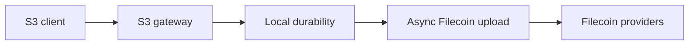

# Architecture

SynapS3 is a single-node gateway between S3 clients and Filecoin storage. It persists writes to local cache, records metadata through repositories, and lets background workers continue the Filecoin upload.

## System Shape

The key boundary is between the S3 response and Filecoin upload. When a write is confirmed, local durability is complete. Filecoin upload continues after the response.

## Main Layers

| Layer | Responsibility |
| --- | --- |
| `cmd/synaps3` | CLI entrypoint, config loading, DB migrations, runtime wiring. |
| `internal/backend` | S3 behavior and VersityGW backend implementation. |
| `internal/cache` | Durable local filesystem cache. |
| `internal/db/repository` | Persistence boundary shared by the backend and workers. |
| `internal/state` | Object lifecycle transition validation. |
| `internal/worker` | Async upload, eviction, leases, retries, recovery. |
| `internal/admin` and `ui/` | Dashboard, Admin API, Admin auth, health, metrics. |
| `internal/synapse` | Narrow wrapper around Synapse SDK behavior. |

## Design Principles

- Confirmed S3 writes must survive async upload failures.
- Raw database access stays behind repositories.
- Object visibility and object storage progress are tracked separately.
- Generation values protect newer writes from stale workers.
- Cache eviction only happens after remote copy metadata satisfies the policy.
- The current design is single-node first and does not assume distributed coordination.

## What This Means for Operators

| Behavior | Operator impact |
| --- | --- |
| S3 writes land locally first | Provider outages do not make accepted writes disappear. |
| Background tasks handle Filecoin upload | Watch task queues and exhausted tasks. |
| Cache is part of durability | Treat cache disk as runtime data, not disposable scratch space. |
| Admin API controls operations | Use Admin auth; keep it on loopback or behind HTTPS and access control. |

## Dashboard Role

The embedded React dashboard is for daily operations. It shows buckets, objects, wallet, tasks, storage topology, settings, and health. It shares the admin server and Admin auth session, and must not be exposed directly to untrusted networks.

## Admin Auth Boundary

Admin API requests are classified by canonical path before they reach the Go `ServeMux`. `/healthz` stays public; `/api/v1/*`, `/metrics`, and `/admin/exhausted-tasks*` require Admin auth. Browser sessions use an HttpOnly cookie, and `POST`, `PUT`, `PATCH`, and `DELETE` also require `X-SynapS3-CSRF`. CLI and scripts may use HTTP Basic auth; Basic-authenticated writes from browsers are checked against their origin headers.

Failed password checks are limited by resolved client IP. Forwarded client, scheme, and host headers are trusted only when `admin.trusted_proxies` matches the direct peer. Logout clears the cookie and revokes the current session token in memory until it expires.
