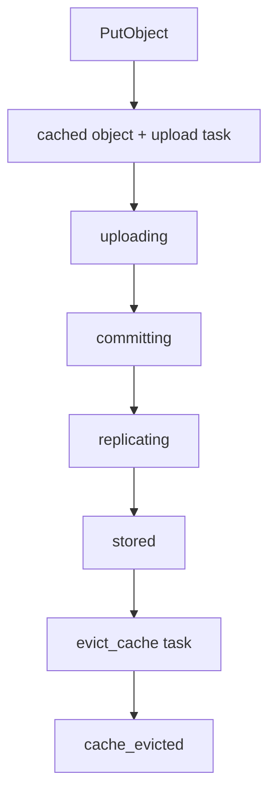

# Filecoin Storage Flow

Filecoin storage starts after the S3 write is accepted. Background workers read locally durable objects, upload them to storage providers, and record remote copy metadata.

## Task Chain



## Object States

| State | Meaning |
| --- | --- |
| `cached` | Object is durable locally and queued for upload. |
| `uploading` | A worker is preparing remote storage or uploading bytes. |
| `committing` | The provider has a piece ready and the commit step is in progress. |
| `replicating` | At least one readable copy exists while target copies are still being completed. |
| `stored` | Target remote copy policy is satisfied and metadata is available. |
| `failed` | The active lifecycle step failed and may be retried. |
| `cache_evicted` | Local cache has been removed after remote durability. |

## Retries and Leases

Workers claim tasks through leases. If a process crashes, startup recovery releases expired leases and resets stalled upload states so work can continue.

Retries are bounded by worker settings. Tasks that exhaust retries need operator action:

```bash
synaps3 admin task list --status exhausted --limit 100
synaps3 admin task retry 42
```

Retry after fixing the underlying issue, such as RPC connectivity, provider reachability, payment funding, FWSS approval, or cache capacity.

## Provider Health

Observability checks record provider and local data set health. The dashboard uses those results to flag unavailable, degraded, or unknown storage copies.

## What Users See

- S3 upload can succeed before Filecoin storage finishes.
- Dashboard task and topology views show storage progress.
- Reads prefer local cache. If remote metadata exists, SynapS3 can retrieve the object from the provider.
- Cache eviction is an operational optimization, not the write acceptance point.
