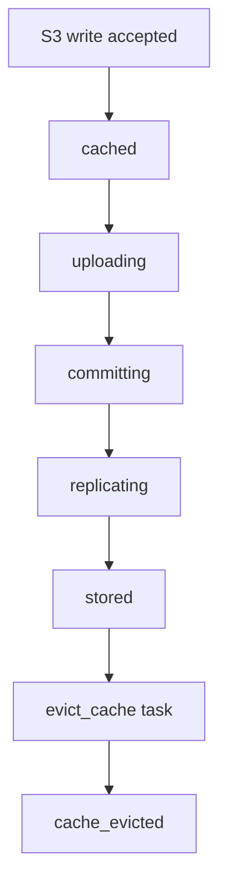

# Filecoin Storage Flow

Filecoin storage starts after the S3 write is accepted. Background tasks read locally durable objects, store them with storage providers, and record the resulting remote copies.

## Task Chain



## Object States

| State | Meaning |
| --- | --- |
| `cached` | Object is durable locally and queued for upload. |
| `uploading` | A background task is preparing remote storage or uploading bytes. |
| `committing` | The provider has a piece ready and the commit step is in progress. |
| `replicating` | At least one readable copy exists while target copies are still being completed. |
| `stored` | Target remote copy policy is satisfied and metadata is available. |
| `failed` | The active lifecycle step failed and may be retried. |
| `cache_evicted` | Local cache has been removed after remote durability. |

## Retries and Recovery

If SynapS3 is interrupted, unfinished tasks become eligible to continue after the service restarts.

Retries are bounded by background task settings. Tasks that exhaust retries need operator action:

```bash
synaps3 admin task list --status exhausted --limit 100
synaps3 admin task retry 42
```

Retry after restoring RPC connectivity, storage provider reachability, wallet funds, FWSS approval, or cache capacity.

## Provider Health

Health checks record storage provider and local data set status. The dashboard uses those results to show copies that are `unavailable`, `degraded`, or `unknown`. These results are observational; recovery from provider unavailability is covered by the replica repair vision below.

## What Users See

- S3 upload can succeed before Filecoin storage finishes.
- Dashboard task and topology views show storage progress.
- Reads prefer local cache. If remote metadata exists, SynapS3 can retrieve the object from the provider.
- Cache eviction is an operational optimization, not the write acceptance point.

## Replica Repair Vision

Coming soon, replica repair will help operators recover the configured target copy count after a storage provider becomes unavailable. It will:

- identify copies affected by storage provider unavailability,
- restore the target copy count through safe, traceable repair,
- show repair progress and cases that require operator action.

This is distinct from completing the initial target copies and retrying failed storage tasks.
