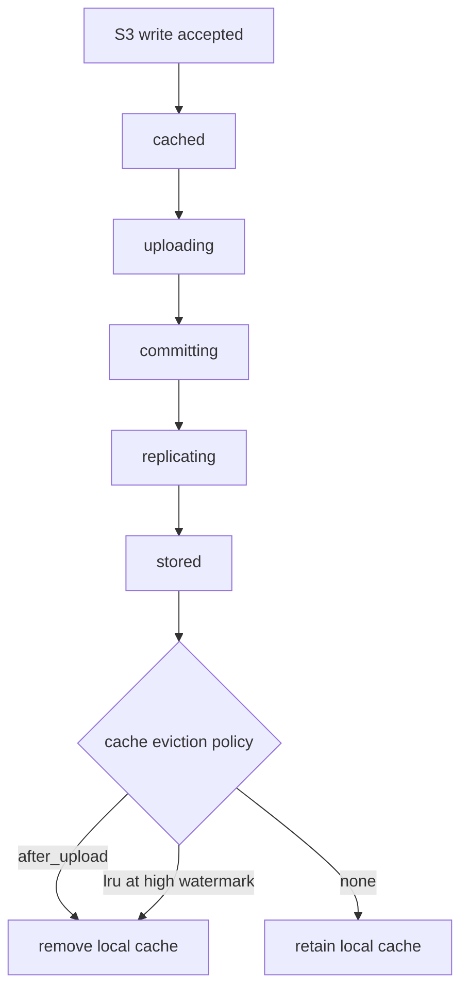

# Filecoin Storage Flow

Filecoin storage starts after the S3 write is accepted. Background tasks read locally durable objects, store them with storage providers, and record the resulting remote copies.

## Task Chain


```mermaid
flowchart TD
  put["S3 write accepted"] --> cached["cached"]
  cached --> uploading["uploading"]
  uploading --> committing["committing"]
  committing --> replicating["replicating"]
  replicating --> stored["stored"]
  stored --> policy{"cache eviction policy"}
  policy -->|"after_upload"| evict["remove local cache"]
  policy -->|"lru at high watermark"| evict
  policy -->|"none"| retain["retain local cache"]
```

## Object States

| State | Meaning |
| --- | --- |
| `cached` | Object is durable locally and queued for upload. |
| `uploading` | A background task is preparing remote storage or uploading bytes. |
| `committing` | The provider has a piece ready and the commit step is in progress. |
| `replicating` | At least one readable committed copy exists, but the bucket's minimum durable copies are not yet met. |
| `stored` | The bucket's minimum durable copies are readable and committed; remaining target copies may still be syncing. |
| `failed` | The active lifecycle step failed and may be retried. |

Cache presence is tracked separately from storage state. A `stored` object may remain in the local cache or be available only from remote storage.

## Retries and Recovery

If SynapS3 is interrupted, unfinished tasks become eligible to continue after the service restarts.

Retries are bounded by background task settings. A task that reaches its limit enters `failed` and needs operator action:

```bash
synaps3 admin task list --status failed --limit 100
synaps3 admin task retry 42
```

Retry after restoring RPC connectivity, storage provider reachability, wallet funds, FWSS approval, or cache capacity, and only when the task is marked retryable.

## Provider Health

Health checks record storage provider and local data set status. The dashboard uses those results to show copies that are `unavailable`, `degraded`, or `unknown`.

If an established provider becomes temporarily unavailable while the initial copies are still being stored, SynapS3 keeps using the other assigned writable copies. The unfinished copy waits without consuming retries and resumes automatically when the original provider becomes reachable again. SynapS3 does not automatically select a replacement provider; see [Replace a Storage Provider](#replace-a-storage-provider) for the operator-approved path. Repairing copies that became unavailable after storage completed remains part of the planned replica repair feature below.

## Target and Minimum Replicas

The target replica count is frozen when an upload starts. A new bucket sets **Release cache after** to its full replica count, so every target replica frozen for that upload must be readable and committed before the cache is released. A bucket can instead set an explicit count from 1 through the current target, and that count stays if Replicas later increases. **Replicas** can only be raised; lowering it is not supported yet. Once that threshold is met, the version becomes stored and its cache follows the configured eviction policy, while remaining replicas continue until the upload's target is reached. The dashboard keeps showing replica sync progress until every frozen target replica is done.

Changing the target affects new uploads. Changing the minimum also re-evaluates retained cache for current uploads. Increasing the minimum does not move versions that are already stored back to an earlier state and cannot restore cache that has already been deleted.

## Replace a Storage Provider

When a provider becomes permanently unavailable, or you plan to move away from one, open the bucket in the dashboard, choose **Details**, then **Storage** → **Data Sets**, and replace the provider. This is always an explicit decision: SynapS3 never swaps a provider on its own, because doing so creates a new paid service and changes where your data lives.

One confirmation covers the whole move. SynapS3 creates the new storage service, switches new uploads to it once it is ready, copies existing data across, and only then shuts down the old provider. Objects copy from another replica or from local cache. An object with neither cannot be copied, and the old provider is not shut down. Data that can still be read from the old provider stays readable until every retained version is readable on the new one.

While replacements run, the Data Sets card shows every move that still needs progress or operator attention, including parallel moves on other replicas. Discovery uses an indeterminate progress bar because the final count is not known yet. Once discovery finishes, progress uses the processed share of the final total. Progress counts unique stored content, so content shared by several versions is copied once, and separates content transferred from content deleted before it needed to move.

Some steps wait rather than fail. The dashboard distinguishes creating the new service, waiting for it to become writable, an unreachable provider, wallet funds, and missing readable content. Most waits resume on their own. If an object has no other replica and no local cache, replacement waits until a source is available; this does not count toward the retry limit. Temporary copy failures resume after a restart and do not stop other content or another replacement. Use **Retry replacement** from the Data Sets list when the dashboard shows that content needs attention, or when shutting down the old provider needs a payment settled first. A target already in use cannot be retried; choose another provider.

## What Users See

- S3 upload can succeed before Filecoin storage finishes.
- Dashboard task and topology views show storage progress.
- Reads prefer local cache. If remote metadata exists, SynapS3 can retrieve the object from the provider.
- Cache eviction is an operational optimization, not the write acceptance point. `after_upload` removes a version after its minimum durable replicas are ready, `lru` waits for capacity pressure, and `none` retains it.

## Planned Replica Repair

Replica repair is planned for a future release. After a storage provider becomes unavailable, it will:

- identify stored copies affected by the provider outage,
- create replacement copies until the configured target copy count is restored,
- show repair progress and failures that require operator action.

This is distinct from completing the initial target copies and retrying failed storage tasks.
