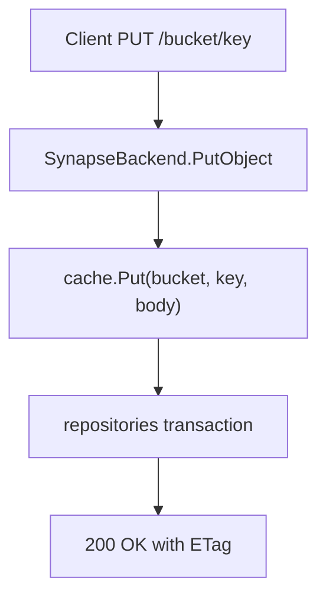

# Write Path and Cache

SynapS3 uses a cache-first write model. A successful S3 write means object bytes are durable on local disk and metadata is committed to the database.

## PutObject Flow

The cache write:

- writes to a temporary file,
- computes MD5 ETag and SHA-256 checksum,
- fsyncs the file,
- atomically renames the file into place,
- fsyncs the parent directory.

The database transaction upserts the object, bumps its generation, and creates an upload task.

## Durability Invariant

> [!IMPORTANT]
> SynapS3 returns success only after both local cache persistence and database commit succeed.

The S3 response does not wait for Filecoin provider latency. After the write is accepted, a background task continues the upload.

## Read Path

`GetObject` reads local cache first. If the cache entry is missing and committed remote metadata is available, SynapS3 can retrieve the object from the provider, verify the checksum, serve the response, and best-effort rehydrate cache.

## Multipart Uploads

Multipart uploads stage parts in the cache. Completion validates requested parts, computes the S3 multipart ETag, assembles the final object, commits metadata, and then cleans up the upload staging directory.

## Operational Impact

| Condition | Meaning |
| --- | --- |
| Cache disk is full | New writes can fail before Filecoin storage is involved. |
| Upload worker is down | Confirmed writes remain local, but remote storage will not progress. |
| Cache entry is evicted | Reads can still succeed when remote metadata exists and retrieval works. |
| Database commit fails | The S3 write does not return success. |

For capacity and recovery steps, see [Runtime Data](../configuration/runtime-data.md) and [Troubleshooting](../operations/troubleshooting.md).
