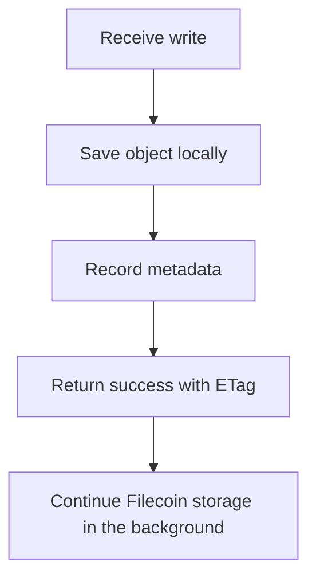

# Write Path and Cache

SynapS3 uses a cache-first write model. A successful S3 write means object bytes are durable on local disk and metadata is committed to the database.

## PutObject Flow

SynapS3 validates the request, saves the object and its metadata, and returns an S3-compatible ETag. Filecoin storage continues after the client receives success.

## Durability Invariant

> [!IMPORTANT]
> SynapS3 returns success only after both local cache persistence and database commit succeed.

The S3 response does not wait for Filecoin provider latency. After the write is accepted, a background task continues the upload.

## Read Path

`GetObject` reads local cache first. If the cache entry is missing and an available remote copy is recorded, SynapS3 can retrieve the object from the storage provider, verify it, serve the response, and restore the local cache when possible.

## Multipart Uploads

Multipart uploads keep parts in local storage until completion. Completing an upload validates the requested parts, assembles the final object, returns the S3 multipart ETag, and schedules background Filecoin storage.

## Operational Impact

| Condition | Meaning |
| --- | --- |
| Cache disk is full | New writes can fail before Filecoin storage is involved. |
| Background storage is not running | Confirmed writes remain local, but remote storage will not progress. |
| Cache entry is evicted | Reads can still succeed when remote metadata exists and retrieval works. |
| Database commit fails | The S3 write does not return success. |

For capacity and recovery steps, see [Runtime Data](../configuration/runtime-data.md) and [Troubleshooting](../operations/troubleshooting.md).
