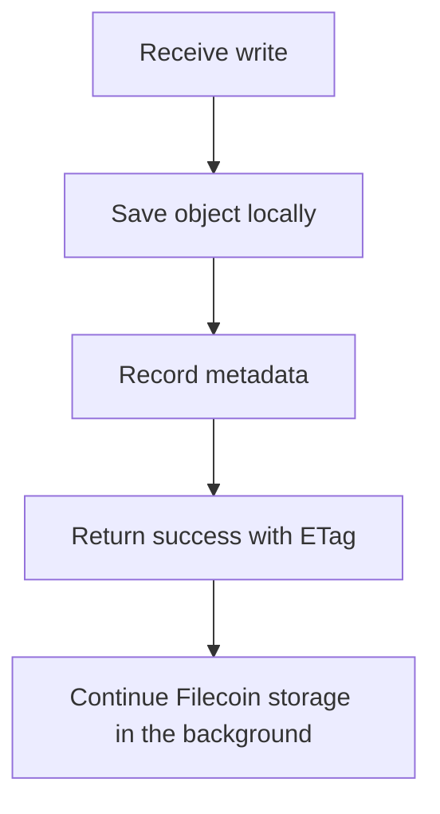

# Write Path and Cache

SynapS3 uses a cache-first write model. A successful S3 write means object bytes are durable on local disk and metadata is committed to the database.

## PutObject Flow

```mermaid
flowchart TD
  request["Receive write"] --> save["Save object locally"]
  save --> metadata["Record metadata"]
  metadata --> response["Return success with ETag"]
  response --> storage["Continue Filecoin storage in the background"]
```

SynapS3 validates the request, saves the object and its metadata, and returns an S3-compatible ETag. Filecoin storage continues after the client receives success.

## Durability Invariant

> [!IMPORTANT]
> SynapS3 returns success only after both local cache persistence and database commit succeed.

The S3 response does not wait for Filecoin provider latency. After the write is accepted, a background task continues the upload.

## Read Path

`GetObject` reads local cache first. If the cache entry is missing and an available remote copy is recorded, SynapS3 can retrieve the object from the storage provider, verify it, serve the response, and restore the local cache when possible.

Successful foreground cache opens refresh the entry's LRU access time. This includes S3 object and range reads, cached CopyObject sources, Admin content downloads, and version restores. Metadata-only operations such as `HeadObject` do not refresh it, and the background Uploader does not make an entry look recently used. A complete remote rehydration starts a new LRU age for the restored entry.

SynapS3 records every successful open in memory and coalesces database updates for the same version to at most one per minute. This keeps repeated reads off the database write path while the process is running. A restart can lose up to one minute of unpersisted access ordering. Access-time persistence remains best effort and never turns a successful read into an error.

## Cache Eviction

| Policy | Behavior |
| --- | --- |
| `lru` | At the high capacity watermark, queue the least recently accessed remotely safe versions until planned usage reaches the low watermark. |
| `after_upload` | Queue each version for removal after all target remote copies commit. |
| `none` | Do not create or run automatic cache eviction work. |

LRU records an access-time snapshot when it plans each task. Immediately before deletion, it reloads the version metadata and checks both the database timestamp and the latest in-process access. Successful cache opens and final deletion are serialized for that version: an open that wins the race keeps the entry and cancels the stale task; a deletion that wins makes the read use the normal remote fallback.

Only versions with a readable committed remote copy are eligible. If usage is caused by multipart data, objects still awaiting remote durability, or other ineligible files, LRU may have nothing safe to remove.

Eviction runs on the Evictor schedule. A new write does not synchronously run LRU, so writes can still return `507 Insufficient Storage` when cleanup cannot keep pace or no safe candidate exists.

An LRU task that exhausts its retries is held for one hour before the same access generation can be tried again while cache usage remains high. The existing task row is reused. A later persisted access creates a new generation that is not blocked by the earlier failure. Operators can retry exhausted work sooner after fixing the underlying problem.

## Multipart Uploads

Multipart uploads keep parts in local storage until completion. Completing an upload validates the requested parts, assembles the final object, returns the S3 multipart ETag, and schedules background Filecoin storage.

## Operational Impact

| Condition | Meaning |
| --- | --- |
| Cache disk is full | New writes can fail before Filecoin storage is involved. |
| Background storage is not running | Confirmed writes remain local, but remote storage will not progress. |
| Cache entry is evicted | Reads can still succeed when remote metadata exists and retrieval works. |
| LRU has no safe candidate | Existing unsafe or in-progress data remains local; new writes can still fail with insufficient storage. |
| Database commit fails | The S3 write does not return success. |

For capacity and recovery steps, see [Runtime Data](../configuration/runtime-data.md) and [Troubleshooting](../operations/troubleshooting.md).
