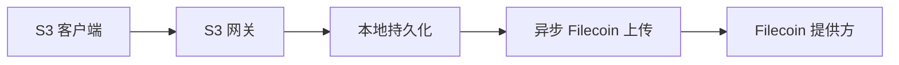

# 架构

SynapS3 是连接 S3 客户端和 Filecoin 存储的单机网关。它先把写入内容落到本地缓存，由 repository 层提交元数据，再让后台工作进程继续上传到 Filecoin。

## 系统形态

关键边界在 S3 响应和 Filecoin 上传之间。写入一旦确认，本地持久化已经完成；Filecoin 上传会在响应之后继续推进。

## 主要层次

| 层 | 职责 |
| --- | --- |
| `cmd/synaps3` | CLI 入口、配置加载、数据库迁移、运行时组装。 |
| `internal/backend` | S3 行为和 VersityGW 后端实现。 |
| `internal/cache` | 可靠的本地文件系统缓存。 |
| `internal/db/repository` | 后端和工作进程共用的持久化边界。 |
| `internal/state` | 对象生命周期状态转换校验。 |
| `internal/worker` | 异步上传、缓存淘汰、租约、重试、恢复。 |
| `internal/admin` 和 `ui/` | 仪表盘、Admin API、Admin 认证、健康检查、指标。 |
| `internal/synapse` | Synapse SDK 行为的窄封装。 |

## 设计原则

- 已确认的 S3 写入必须能承受异步上传失败。
- 原始数据库访问留在 repositories 后面。
- 对象可见性和对象存储进度分开判断。
- Generation 值避免旧工作进程覆盖较新的写入。
- 只有远端副本元数据满足策略后，才执行缓存淘汰。
- 设计优先单机，不依赖分布式协调。

## 对运维的影响

| 行为 | 运维影响 |
| --- | --- |
| S3 写入先落本地 | 存储提供方故障不会让已接受写入消失。 |
| 后台任务处理 Filecoin 上传 | 需要关注任务队列和 exhausted 任务。 |
| 缓存是持久性的一部分 | 缓存磁盘不是可随意丢弃的临时目录。 |
| Admin API 控制运维操作 | 使用 Admin 认证；保持本机回环地址或放在 HTTPS 和访问控制之后。 |

## 仪表盘角色

内嵌 React 仪表盘用于日常运维。它展示 bucket、object、钱包状态、后台任务、存储拓扑、设置和健康状态。仪表盘和 Admin API 共用 Admin 服务和 Admin 会话，不应直接暴露给不可信网络。

## Admin 认证边界

Admin API 请求会先按规范化路径分类，再进入 Go `ServeMux`。`/healthz` 保持公开；`/api/v1/*`、`/metrics` 和 `/admin/exhausted-tasks*` 需要 Admin 认证。浏览器会话使用 HttpOnly cookie，`POST`、`PUT`、`PATCH`、`DELETE` 还必须带 `X-SynapS3-CSRF`。CLI 和脚本可以使用 HTTP Basic auth；来自浏览器的 Basic auth 写请求会做来源校验。

密码失败会按解析后的客户端 IP 限流。只有直接来源命中 `admin.trusted_proxies` 时，才信任转发的客户端、协议和主机 header。Logout 会清除 cookie，并在当前进程内撤销当前 session token，直到它自然过期。
