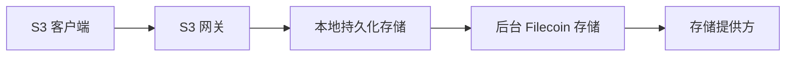

# 架构

SynapS3 是连接 S3 客户端和 Filecoin 存储的单机网关。它接受 S3 请求，确保已接受写入在本地持久化，再由后台任务继续完成 Filecoin 存储。

## 系统形态

关键边界在 S3 响应和 Filecoin 上传之间。写入一旦确认，本地持久化已经完成；Filecoin 上传会在响应之后继续推进。

## 用户可见组件

| 组件 | 职责 |
| --- | --- |
| S3 客户端 | 使用熟悉的 S3 操作和访问凭据。 |
| S3 网关 | 校验请求并返回 S3 兼容响应。 |
| 本地持久化存储 | 在后台存储推进期间，保存已接受的对象数据和元数据。 |
| 后台 Filecoin 存储 | 完成首次目标副本、重试失败任务，并在策略允许时淘汰缓存。 |
| 仪表盘和 Admin API | 展示健康状态、存储进度、配置和需要运维处理的情况。 |

## 设计原则

- 已确认的 S3 写入必须能承受异步上传失败。
- 对象可见性和对象存储进度分开判断。
- 只有配置的远端副本策略满足后，才执行缓存淘汰。
- 设计优先单机，不依赖分布式协调。

## 对运维的影响

| 行为 | 运维影响 |
| --- | --- |
| S3 写入先落本地 | 本地运行数据完好且缓存尚未淘汰时，已接受写入可从本地存储读取；淘汰后，读取需要可用的远端副本。 |
| 后台任务处理 Filecoin 上传 | 需要关注任务队列和 exhausted 任务。 |
| 缓存是持久性的一部分 | 缓存磁盘不是可随意丢弃的临时目录。 |
| Admin API 控制运维操作 | 使用 Admin 认证；保持本机回环地址或放在 HTTPS 和访问控制之后。 |

## 仪表盘角色

仪表盘用于日常运维。它展示存储桶、对象、钱包状态、后台任务、存储拓扑、设置和健康状态。仪表盘与 Admin API 使用同一个受保护的 Admin 端点，不应直接暴露给不可信网络。

## Admin 认证边界

`/healthz` 保持公开，便于健康检查无需凭据即可运行。受保护的 Admin API 路由、指标和后台任务操作需要 Admin 认证。浏览器会话还使用 `X-SynapS3-CSRF` 保护修改状态的请求；CLI 和脚本可以使用 HTTP Basic 认证。

让 Admin 端点只监听回环地址、通过 SSH 隧道访问，或放在受控的 HTTPS 反向代理之后。如果反向代理会转发客户端信息，只在 `admin.trusted_proxies` 中配置可信代理地址。公开认证契约见 [Admin API 参考](../reference/admin-api.md)。
