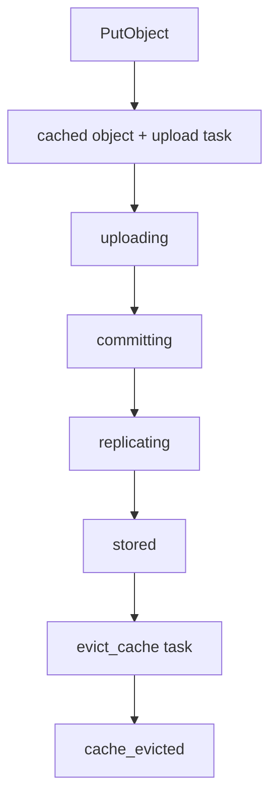

# Filecoin 存储流程

S3 写入被接受后，Filecoin 存储才开始推进。后台工作进程会读取本地持久化对象，把它上传到存储提供方，并记录远端副本元数据。

## 任务链



## 对象状态

| 状态 | 含义 |
| --- | --- |
| `cached` | 对象已在本地持久化，并排队等待上传。 |
| `uploading` | 工作进程正在准备远端存储或上传对象数据。 |
| `committing` | 存储提供方已有 piece，commit 步骤正在进行。 |
| `replicating` | 至少已有一个可读副本，目标副本数仍在补齐。 |
| `stored` | 目标远端副本策略已满足，并且已有存储元数据。 |
| `failed` | 正在执行的生命周期步骤失败，可重试。 |
| `cache_evicted` | 远端持久化后，本地缓存已清理。 |

## 重试与租约

工作进程通过租约领取任务。如果进程崩溃，启动恢复会释放过期租约，并重置停滞的上传状态，让任务可以继续。

重试次数由工作进程设置限制。耗尽重试次数的任务需要运维处理：

```bash
synaps3 admin task list --status exhausted --limit 100
synaps3 admin task retry 42
```

重试前先修复底层问题，例如 RPC 连接、存储提供方可达性、payment funding、FWSS approval 或缓存容量。

## 存储提供方健康状态

健康检查会记录存储提供方和本地 data set 的状态。仪表盘的 storage-health 视图会使用这些结果，标出 `unavailable`、`degraded` 或 `unknown` 的存储副本。

## 用户能看到什么

- S3 上传可以在 Filecoin 存储完成前成功。
- 仪表盘的任务和拓扑视图会展示存储进度。
- 读取优先使用本地缓存；已有远端元数据时，可以从存储提供方取回对象。
- 缓存淘汰是运维优化，不是写入接受点。
