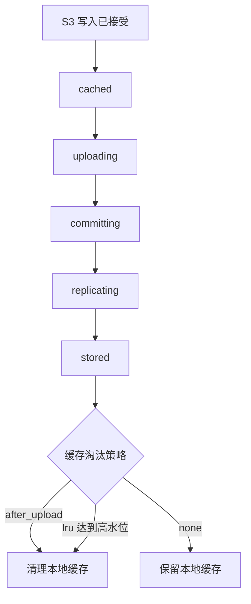

# Filecoin 存储流程

S3 写入被接受后，Filecoin 存储才开始推进。后台任务会读取本地持久化对象，将其存入存储提供方，并记录最终形成的远端副本。

## 任务链


```mermaid
flowchart TD
  put["S3 写入已接受"] --> cached["cached"]
  cached --> uploading["uploading"]
  uploading --> committing["committing"]
  committing --> replicating["replicating"]
  replicating --> stored["stored"]
  stored --> policy{"缓存淘汰策略"}
  policy -->|"after_upload"| evict["清理本地缓存"]
  policy -->|"lru 达到高水位"| evict
  policy -->|"none"| retain["保留本地缓存"]
```

## 对象状态

| 状态 | 含义 |
| --- | --- |
| `cached` | 对象已在本地持久化，并排队等待上传。 |
| `uploading` | 后台任务正在准备远端存储或上传对象数据。 |
| `committing` | 存储提供方已有 piece，commit 步骤正在进行。 |
| `replicating` | 至少已有一个可读已提交副本，但尚未达到存储桶的最低耐久副本门槛。 |
| `stored` | 存储桶要求的最低耐久副本已可读并提交；其余目标副本可能仍在补齐。 |
| `failed` | 正在执行的生命周期步骤失败，可重试。 |

缓存是否存在与存储状态分开记录。`stored` 对象可能仍保留在本地缓存，也可能仅能从远端存储读取。

## 重试与恢复

如果 SynapS3 运行中断，未完成的后台任务会在服务重启后重新进入可继续处理的状态。

重试次数由后台任务设置限制。达到上限的任务会进入 `failed`，需要运维处理：

```bash
synaps3 admin task list --status failed --limit 100
synaps3 admin task retry 42
```

重试前先恢复 RPC 连接、存储提供方可达性、钱包余额、FWSS approval 或缓存容量，并且只重试标记为可重试的任务。

## 存储提供方健康状态

健康检查会记录存储提供方和本地数据集的状态。仪表盘会使用这些结果，标出 `unavailable`、`degraded` 或 `unknown` 的存储副本。

如果已建立的存储提供方在首次副本尚未全部完成时暂时不可用，SynapS3 会继续使用其他已分配且可写的副本。未完成副本会等待且不消耗重试次数，并在原存储提供方恢复可达后自动继续；系统不会自动选择替代存储提供方，运营者批准的替换路径见[替换存储提供方](#替换存储提供方)。已完成存储的副本随后变为不可用时，其修复仍属于下面计划支持的副本修复功能。

## 目标副本与最低耐久副本

上传开始时会冻结目标副本数。新建存储桶时 **Release cache after** 等于其目标副本数，因此该次上传冻结的全部目标副本都必须可读并完成提交后才释放缓存。存储桶也可以设置 1 到当前目标之间的显式数量，该数量在目标随后提高时保持不变。**Replicas** 只能调高，目前不支持调低。达到该门槛后，版本进入已存储状态，缓存按已配置的淘汰策略处理；其余副本会继续补齐，直到达到该次上传的目标副本数。在冻结的目标副本全部完成前，仪表盘会继续显示副本同步进度。

修改目标副本数只影响新上传。修改最低耐久副本数也会重新评估当前上传仍保留的缓存。提高门槛不会让已经进入已存储状态的版本回退，也无法恢复已经删除的缓存。

## 替换存储提供方

当某个存储提供方永久不可用，或者你计划迁离它时，在仪表盘打开该存储桶，选择 **Details**，然后到 **Storage** → **Data Sets** 替换存储提供方。这始终是一次明确的决定：SynapS3 不会自行更换存储提供方，因为这会创建新的付费服务，并改变数据的存放位置。

一次确认覆盖整个迁移过程。SynapS3 会创建新的存储服务，新存储提供方就绪后把新上传切换过去，复制已有数据，然后才关闭旧存储提供方。对象从其他副本或本地缓存复制。两者都没有的对象无法复制，旧存储提供方也不会被关闭。仍能从旧存储提供方读取的数据会保持可读，直到每个保留版本都能从新存储提供方读取。

替换进行期间，Data Sets 卡片会显示仍需推进或需要操作的所有迁移，包括其他副本上的并行迁移。发现内容时还不知道最终总数，因此使用不确定进度条；发现完成后，按最终总数中的已处理比例显示确定进度。进度按唯一存储内容计数，因此被多个版本共享的内容只复制一次，并分别统计已迁移内容与复制前已删除、无需再迁移的内容。

有些步骤是等待而不是失败。仪表盘会区分创建新服务、等待服务可写、存储提供方不可达、钱包资金和缺少可读内容。多数等待会自行继续。如果某个对象既没有其他副本、也没有本地缓存，替换会等待到来源可用，并且这段等待不计入重试次数。暂时的复制失败会在重启后继续，也不会阻断其他内容或另一条替换。当仪表盘提示内容需要处理，或关闭旧存储提供方前需要结清欠费时，在 Data Sets 列表中使用 **Retry replacement**。目标已被占用时不能重试，请改选存储提供方。

## 用户能看到什么

- S3 上传可以在 Filecoin 存储完成前成功。
- 仪表盘的任务和拓扑视图会展示存储进度。
- 读取优先使用本地缓存；已有远端元数据时，可以从存储提供方取回对象。
- 缓存淘汰是运维优化，不是写入接受点。`after_upload` 会在最低耐久副本就绪后清理版本，`lru` 等待容量压力，`none` 则保留本地缓存。

## 计划支持的副本修复

副本修复计划在后续版本提供。存储提供方变为不可用后，该功能将：

- 识别受存储提供方故障影响的已存储副本；
- 创建替代副本，直到恢复配置的目标副本数；
- 显示修复进度，以及需要运维人员处理的失败。

它不同于首次目标副本补齐和失败存储任务重试流程。
