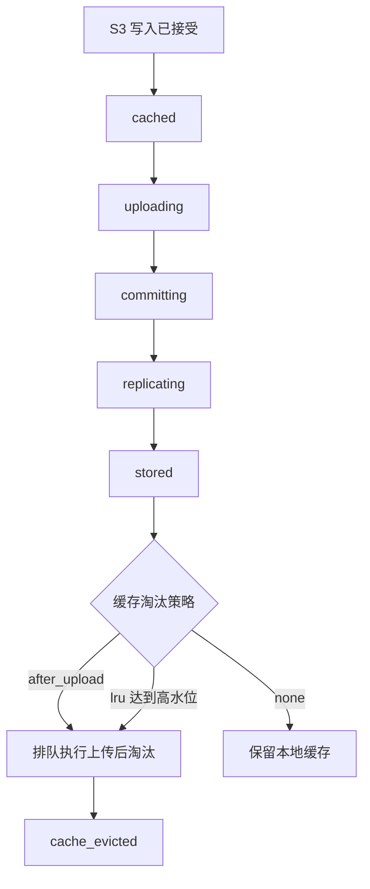

# Filecoin 存储流程

S3 写入被接受后，Filecoin 存储才开始推进。后台任务会读取本地持久化对象，将其存入存储提供方，并记录最终形成的远端副本。

## 任务链


```mermaid
flowchart TD
  put["S3 写入已接受"] --> cached["cached"]
  cached --> uploading["uploading"]
  uploading --> committing["committing"]
  committing --> replicating["replicating"]
  replicating --> stored["stored"]
  stored --> policy{"缓存淘汰策略"}
  policy -->|"after_upload"| evict["排队执行上传后淘汰"]
  policy -->|"lru 达到高水位"| evict
  policy -->|"none"| retain["保留本地缓存"]
  evict --> evicted["cache_evicted"]
```

## 对象状态

| 状态 | 含义 |
| --- | --- |
| `cached` | 对象已在本地持久化，并排队等待上传。 |
| `uploading` | 后台任务正在准备远端存储或上传对象数据。 |
| `committing` | 存储提供方已有 piece，commit 步骤正在进行。 |
| `replicating` | 至少已有一个可读已提交副本，但尚未达到存储桶的最低耐久副本门槛。 |
| `stored` | 存储桶要求的最低耐久副本已可读并提交；其余目标副本可能仍在补齐。 |
| `failed` | 正在执行的生命周期步骤失败，可重试。 |
| `cache_evicted` | 远端持久化后，本地缓存已清理。 |

## 重试与恢复

如果 SynapS3 运行中断，未完成的后台任务会在服务重启后重新进入可继续处理的状态。

重试次数由后台任务设置限制。耗尽重试次数的任务需要运维处理：

```bash
synaps3 admin task list --status exhausted --limit 100
synaps3 admin task retry 42
```

重试前先恢复 RPC 连接、存储提供方可达性、钱包余额、FWSS approval 或缓存容量。

## 存储提供方健康状态

健康检查会记录存储提供方和本地数据集的状态。仪表盘会使用这些结果，标出 `unavailable`、`degraded` 或 `unknown` 的存储副本。

如果已建立的存储提供方在首次副本尚未全部完成时暂时不可用，SynapS3 会继续使用其他已分配且可写的副本。未完成副本会等待且不消耗重试次数，并在原存储提供方恢复可达后自动继续；系统不会自动选择替代提供方。已完成存储的副本随后变为不可用时，其修复仍属于下面计划支持的副本修复功能。

## 目标副本与最低耐久副本

上传开始时会冻结目标副本数。默认情况下，**Release cache after** 为 **All replicas (strict)**：该次上传冻结的全部目标副本都必须可读并完成提交。存储桶也可以设置 1 到当前目标之间的显式数量。显式数量在目标随后提高时保持不变；如果把 Replicas 降到低于该数量，请求会被拒绝，必须同时降低 Release cache after。**All replicas (strict)** 会跟随每次上传冻结的目标。达到该门槛后，版本进入已存储状态，缓存按已配置的淘汰策略处理；其余副本会继续补齐，直到达到该次上传的目标副本数。在冻结的目标副本全部完成前，仪表盘会继续显示副本同步进度。

修改目标副本数只影响新上传。修改最低耐久副本数也会重新评估当前上传仍保留的缓存。提高门槛不会让已经进入已存储状态的版本回退，也无法恢复已经删除的缓存。

## 用户能看到什么

- S3 上传可以在 Filecoin 存储完成前成功。
- 仪表盘的任务和拓扑视图会展示存储进度。
- 读取优先使用本地缓存；已有远端元数据时，可以从存储提供方取回对象。
- 缓存淘汰是运维优化，不是写入接受点。`after_upload` 会在最低耐久副本就绪后清理版本，`lru` 等待容量压力，`none` 则保留本地缓存。

## 计划支持的副本修复

副本修复计划在后续版本提供。存储提供方变为不可用后，该功能将：

- 识别受提供方故障影响的已存储副本；
- 创建替代副本，直到恢复配置的目标副本数；
- 显示修复进度，以及需要运维人员处理的失败。

它不同于首次目标副本补齐和失败存储任务重试流程。
