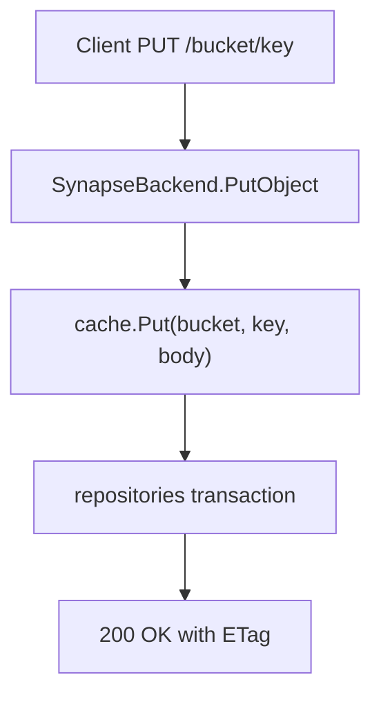

# 写入路径与缓存

SynapS3 采用缓存优先的写入模型。一次 S3 写入返回成功，表示对象内容已经持久化到本地磁盘，元数据也已经提交到数据库。

## PutObject 流程

缓存写入会：

- 写入临时文件，
- 计算 MD5 ETag 和 SHA-256 checksum，
- fsync 文件，
- 原子 rename 到最终位置，
- fsync 父目录。

数据库事务会写入或更新 object，递增 generation，并创建上传任务。

## 持久化不变量

> [!IMPORTANT]
> SynapS3 只有在本地缓存持久化和数据库提交都成功后才返回成功。

因此，S3 响应不需要等待 Filecoin 存储提供方。对象被接受后，后台任务再继续上传。

## 读取路径

`GetObject` 会先读本地缓存。缓存缺失时，如果已有已提交的远端元数据，SynapS3 可以从存储提供方取回对象，校验 checksum，返回响应，并尽力回填缓存。

## Multipart Uploads

Multipart upload 会把各个 part 暂存在缓存中。Complete 会校验请求中的 part，计算 S3 multipart ETag，组装最终对象，提交元数据，然后清理上传暂存目录。

## 运维影响

| 条件 | 含义 |
| --- | --- |
| 缓存磁盘已满 | 新写入可能在进入 Filecoin 存储前失败。 |
| 上传工作进程停止 | 已确认写入仍在本地，但远端存储不会推进。 |
| 缓存对象已淘汰 | 如果远端元数据存在且对象可取回，读取仍可成功。 |
| 数据库提交失败 | S3 写入不会返回成功。 |

容量和恢复步骤见[运行数据](../configuration/runtime-data.md)和[故障排查](../operations/troubleshooting.md)。
