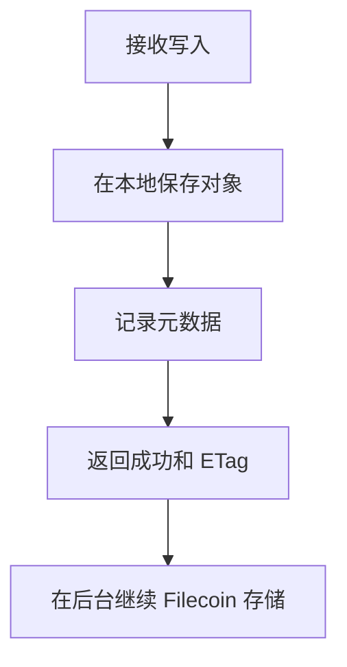

# 写入路径与缓存

SynapS3 采用缓存优先的写入模型。一次 S3 写入返回成功，表示对象内容已经持久化到本地磁盘，元数据也已经提交到数据库。

## PutObject 流程

```mermaid
flowchart TD
  request["接收写入"] --> save["在本地保存对象"]
  save --> metadata["记录元数据"]
  metadata --> response["返回成功和 ETag"]
  response --> storage["在后台继续 Filecoin 存储"]
```

SynapS3 会校验请求，保存对象及其元数据，再返回 S3 兼容的 ETag。客户端收到成功响应后，Filecoin 存储会继续推进。

## 持久化不变量

> [!IMPORTANT]
> SynapS3 只有在本地缓存持久化和数据库提交都成功后才返回成功。

因此，S3 响应不需要等待 Filecoin 存储提供方。对象被接受后，后台任务再继续上传。

## 读取路径

`GetObject` 会先读本地缓存。缓存缺失时，如果记录了可用的远端副本，SynapS3 可以从存储提供方取回并校验对象、返回响应，并在可能时恢复本地缓存。

前台成功打开缓存时，会刷新该条目的 LRU 访问时间。这包括 S3 对象和 Range 读取、命中缓存的 CopyObject 源、Admin 内容下载和版本恢复。`HeadObject` 等只读元数据操作不会刷新，后台 Uploader 读取也不会让条目看起来刚被使用。远端内容完整回填后，会为恢复的缓存重新开始计算 LRU 时间。

SynapS3 会在内存中记录每次成功打开，并把同一版本的数据库更新合并为每分钟最多一次，从而避免重复读取持续写数据库。进程重启时，最多可能丢失一分钟尚未持久化的访问顺序。访问时间仍按 best-effort 方式持久化，更新失败不会让原本成功的读取失败。

## 缓存淘汰

| 策略 | 行为 |
| --- | --- |
| `lru` | 达到容量高水位后，按最近访问时间为远端安全的版本排队，直到计划使用量降至低水位。 |
| `after_upload` | 所有目标远端副本提交后，为该版本排队清理。 |
| `none` | 不创建或执行自动缓存淘汰任务。 |

LRU 在规划任务时记录访问时间快照。真正删除前，它会重新读取版本元数据，同时检查数据库时间和进程内最新访问。同一版本的成功缓存打开与最终删除会串行执行：读取先完成时会保留条目并取消过期任务；删除先完成时，读取会按正常流程从远端回退。

只有存在可读已提交远端副本的版本才可淘汰。如果空间主要由 multipart 数据、尚未达到远端安全状态的对象或其他不符合条件的文件占用，LRU 可能找不到安全候选。

淘汰按 Evictor 调度异步运行。新写入不会同步执行 LRU，因此清理追赶不及时或没有安全候选时，写入仍可能返回 `507 Insufficient Storage`。

LRU 任务耗尽重试后，同一访问代际会冷却一小时。只要缓存仍高于水位，系统会复用原任务继续执行。后续访问一旦持久化为新代际，就不会被旧失败挡住。修复故障后，运维人员可以提前手动重试。

## 分段上传

分段上传会把各分段保存在本地，直到完成上传。完成时会校验请求中的分段、组装最终对象、返回 S3 multipart ETag，并安排后台 Filecoin 存储。

## 运维影响

| 条件 | 含义 |
| --- | --- |
| 缓存磁盘已满 | 新写入可能在进入 Filecoin 存储前失败。 |
| 后台存储未运行 | 已确认写入仍在本地，但远端存储不会推进。 |
| 缓存对象已淘汰 | 如果远端元数据存在且对象可取回，读取仍可成功。 |
| LRU 没有安全候选 | 不安全或仍在处理的数据会继续保留，新写入仍可能因空间不足失败。 |
| 数据库提交失败 | S3 写入不会返回成功。 |

容量和恢复步骤见[运行数据](../configuration/runtime-data.md)和[故障排查](../operations/troubleshooting.md)。
